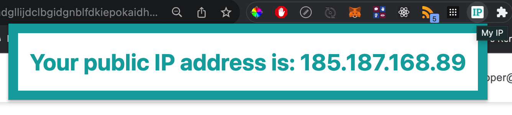

# My IP 
A Chrome extension to show your public IP address.

## Where to Get It 
Get it from the [Chrome Web Store](https://chrome.google.com/webstore/detail/my-ip/pbmdgllijdclbgidgnblfdkiepokaidh).

## Preview

## How It Works
1. After installing the extension, pin it to your browser.
2. To see your public IP address, click on the icon.
3. A popup should appear showing your public IP address.

## Behind the Scenes
1. When user clicks on the icon, Chrome looks at `manifest.json` and finds:
<pre>
"action": {
    "default_popup": "index.html"
    ...
}
</pre>
2. This brings up the HTML from `index.html`, which brings with it the script in `index.js`.
3. `index.js` makes a `GET` call to `https://api.ipify.org?format=json` to fetch the IP address. 
4. The API responds with the IP address which is then displayed in the HTML popup.

## Why
1. I wanted to learn the process of publishing a Chrome extension on the Chrome Web Store. 
2. I chose to implement the ***public IP address finder*** functionality since it is an easy yet useful one. Internet users already have other options like putting ***What is my IP address*** into Google, or something like `curl ifconfig.me` in Terminal. This Chrome extension option is more convenient since all it takes is one click on the icon and you have your public IP which you could then copy to your clipboard.

## Interesting
1. The process of creating a developer account to publish your Chrome extension on the Chrome Web Store requires filling out your information. 
2. To publish, your extension goes through a review period before it is accepted and published. 
3. You also need to let the Chrome Web Store team know if your extension will be collecting user data.
